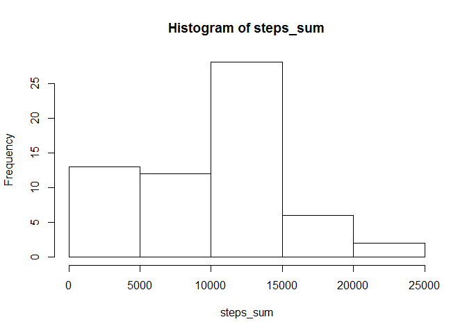

## Loading and preprocessing the data
1. Load the data (i.e. read.csv()\color{red}{\verb|read.csv()|}read.csv())

```r
df <- read.csv('activity.csv', na='NA')
```
2. Process/transform the data (if necessary) into a format suitable for your analysis

```r
attach(df)
```

## What is mean total number of steps taken per day?
1. Calculate the total number of steps taken per day

```r
steps_sum <- tapply(steps,date,sum,na.rm=T)
hist(steps_sum)
```

<!-- -->

2. If you do not understand the difference between a histogram and a barplot, research the difference between them. Make a histogram of the total number of steps taken each day

```r
hist(steps_sum)
```

<!-- -->

3. Calculate and report the mean and median of the total number of steps taken per day

```r
#Mean
mean(steps_sum)
```

```
## [1] 9354.23
```

```r
#Median
median(steps_sum)
```

```
## [1] 10395
```

## What is the average daily activity pattern?


## Imputing missing values


## Are there differences in activity patterns between weekdays and weekends?
